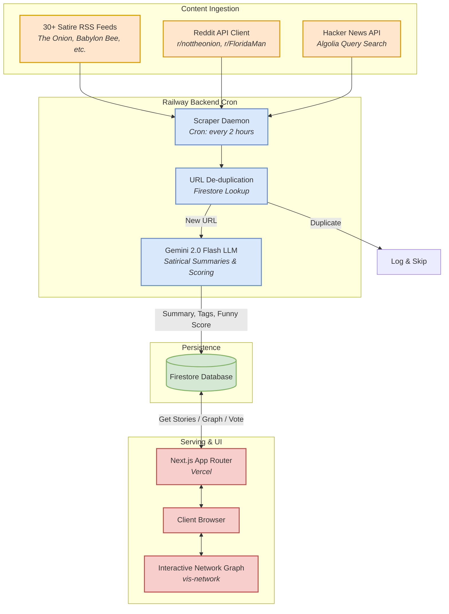
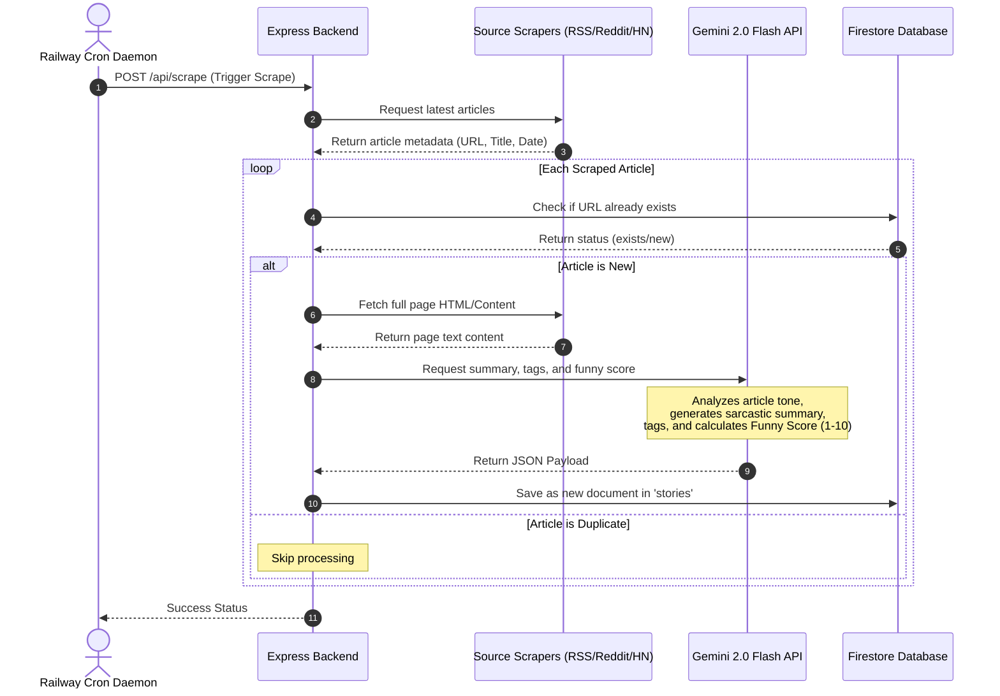

# 🗞️ FunnyNews

> **An AI-powered aggregator and deadpan satire engine for absurd, bizarre, and genuinely weird news.**

<div align="center">

[](https://nextjs.org/)
[](https://reactjs.org/)
[](https://www.typescriptlang.org/)
[](https://tailwindcss.com/)
<br/>
[](https://firebase.google.com/)
[](https://deepmind.google/technologies/gemini/)
[](https://vercel.com/)
[](https://railway.app/)

</div>

---

## 🌐 Live Application
- **Frontend URL**: [funnynews.club](https://funnynews.club) (Hosted on Vercel)
- **Backend URL**: [Express REST API on Railway](https://railway.app/) (Background daemon & scheduled processing)

---

## ⚡ Overview & Features

**FunnyNews** is a modern, high-performance web platform designed to aggregate, refine, and visualize the internet's most absurd stories. By crawling over **30 RSS feeds, Reddit endpoints, and Hacker News search graphs**, the application feeds raw news into the **Google Gemini 2.0 Flash** model to generate dry, deadpan summaries, extract category/mood tags, and compute a calibrated **Funny Score**.

### Core Capabilities:
- 🤖 **Autonomous Satire Engine**: Scrapes bizarre data every 2 hours via a persistent backend worker running on Railway, applying automated HTML cleaning and de-duplication.
- ✍️ **Deadpan Summarization**: Gemini API parses the articles and refactors them into dry, satirical, single-paragraph digests, complete with funny tags.
- 🕸️ **Story Network Graph**: Renders a beautiful, force-directed node graph using `vis-network` to map relationships (follow-ups, contradictions, updates) between stories.
- 📈 **Calibrated Funny Score**: Custom AI evaluation ranges from 1 to 10 to help users filter feed results instantly.
- ⚡ **Dual-Deploy Infrastructure**: Optimizes static rendering, client caching, and background compute by running frontend pages on Vercel serverless and pipeline crawlers on Railway container daemons.

---

## 🏗️ System Architecture & Data Flow

Below are the detailed system architecture diagrams showcasing how FunnyNews processes news items from initial ingestion to UI rendering.

### Data Ingestion & Enrichment Pipeline



### Scraping & Enrichment Sequence



---

## 🛠️ Technology Stack

| Tier | Technology / Library | Purpose | Hosting / Environment |
| :--- | :--- | :--- | :--- |
| **Frontend** | **Next.js 14 (App Router)** | Static generation, SSR, page layout, API routing | **Vercel** |
| **Styling** | **Tailwind CSS + Lucide Icons** | Custom color systems, dark mode toggles, adaptive lists | |
| **Backend** | **Express.js + TypeScript** | Dedicated scheduler, API controllers, and scraping pipelines | **Railway** |
| **Scheduler**| **node-cron** | Periodically triggers scraper workers in the backend container | |
| **Database** | **Firebase Firestore** | NoSQL document storage for stories, votes tracking, and nodes | **Google Cloud** |
| **AI Processing** | **Google Gemini 2.0 Flash** | Summary generation, classification of funny scores, topic tagging | |
| **Network Graph** | **vis-network / vis-data** | Renders HTML5 canvas story node-link relationships visually | Client Side |

---

## 📁 Project Structure

```bash
NewsSite/
├── app/                           # Next.js App Router Pages
│   ├── layout.tsx                 # Base layout, theme providers, & global metadata
│   ├── page.tsx                   # Interactive home feed with category & score filters
│   ├── discover/                  # Discover news filtered by category & tag combinations
│   ├── trending/                  # Trending news feed sorted by votes/views
│   ├── story/[id]/                # Detail page containing the AI analysis & article link
│   ├── graph/                     # Renders the full interactive vis-network story graph
│   └── api/                       # Next.js Serverless API endpoints
│       ├── stories/               # Serverless endpoints for fetching/voting stories
│       ├── scrape/                # On-demand scraping trigger
│       └── graph/                 # Retreives relationship node/edge database records
│
├── backend/                       # Express API Server (Railway background container)
│   ├── src/
│   │   ├── index.ts               # Server entry point, CORS configuration, and middleware
│   │   ├── cron.ts                # node-cron scheduled scraper jobs
│   │   ├── routes/                # Backend API routers (stories, scrape, graph)
│   │   ├── scrapers/              # Scraper files (RSS feed parser, Reddit API, HN search client)
│   │   ├── firebase/              # Firebase Admin SDK setups & database helpers
│   │   └── ai/                    # Gemini API initialization & prompt generation
│   ├── Dockerfile                 # Docker configuration for Railway build process
│   └── railway.toml               # Custom Railway app configuration spec
│
├── components/                    # Reusable React UI Components
│   ├── Header.tsx                 # Core Navbar with dark-mode switcher and routes
│   ├── Filters.tsx                # Category tags list, Funny Score sliders, & search input
│   ├── StoryCard.tsx              # Component card showing summaries, tags, and vote counts
│   ├── NetworkGraph.tsx           # Renders interactive nodes representing active stories
│   └── ui/                        # Reusable Tailwind primitive buttons and badges
│
├── lib/                           # Shared Library Initializations
│   ├── firebase/                  # Client SDK credentials & tracking helpers
│   └── ai/                        # Client-side AI prompt endpoints
│
└── types/                         # Shared TypeScript interfaces & types
```

---

## 📊 Database Schema (Firestore)

FunnyNews persists metadata inside Google Firestore collections with the following document mappings:

### 1. `stories` Collection
Stores enriched articles crawled from the scrapers.
```typescript
{
  id: string,                 // URL Slug-based Document ID (unique key)
  title: string,              // Cleaned title of the original post
  url: string,                // Original destination URL
  source: string,             // Source name (e.g. "The Onion", "r/FloridaMan")
  source_type: string,        // "reddit" | "rss" | "api" | "manual"
  summary: string,            // Sarcastic, AI-generated summary
  content: string,            // Parsed article text cache
  funny_score: number,        // Gemini-assigned rating (1 to 10)
  tags: string[],             // Topic & emoji tags (e.g. ["🍕 Food", "🐊 Florida"])
  upvotes: number,            // Total user upvotes
  downvotes: number,          // Total user downvotes
  view_count: number,         // Total pageviews recorded
  image_url: string | null,   // Scraped image URL or fallback placeholder
  published_at: Timestamp,    // Published timestamp from source metadata
  scraped_at: Timestamp,      // Processed timestamp by backend scheduler
  created_at: Timestamp,
  updated_at: Timestamp
}
```

### 2. `votes` Collection
Tracks user voting events using salted hashes of user IP addresses to block multiple votes.
```typescript
{
  story_id: string,           // Target story document slug
  ip_address: string,         // Salted & hashed IP signature
  vote_type: "upvote" | "downvote",
  created_at: Timestamp
}
```

### 3. `story_relationships` Collection
Defines edge connections for rendering the Network Graph page.
```typescript
{
  source_id: string,          // Slug of origin story node
  target_id: string,          // Slug of target story node
  relationship_type: string,  // "similar" | "follow_up" | "contradicts" | "updates"
  strength: number,           // Correlation coefficient score (1 to 10)
  created_at: Timestamp
}
```

---

## 🔑 Environment Variables

To spin up the ecosystem, configure the environment variables as follows:

### Next.js Frontend (`.env.local`)
| Variable Key | Required | Value / Format |
| :--- | :---: | :--- |
| `NEXT_PUBLIC_FIREBASE_API_KEY` | **Yes** | Client API key for Firebase auth/analytics |
| `NEXT_PUBLIC_FIREBASE_AUTH_DOMAIN` | **Yes** | `[project-id].firebaseapp.com` |
| `NEXT_PUBLIC_FIREBASE_PROJECT_ID` | **Yes** | Firestore database project ID |
| `NEXT_PUBLIC_FIREBASE_STORAGE_BUCKET` | **Yes** | Storage path for assets |
| `NEXT_PUBLIC_FIREBASE_MESSAGING_SENDER_ID`| **Yes** | Numeric sender key |
| `NEXT_PUBLIC_FIREBASE_APP_ID` | **Yes** | Firebase web client app identifier |
| `FIREBASE_PROJECT_ID` | **Yes** | Project ID for Admin SDK serverless actions |
| `FIREBASE_CLIENT_EMAIL` | **Yes** | Service account client email |
| `FIREBASE_PRIVATE_KEY` | **Yes** | Service account private key (use double-quotes & `\n`) |
| `GEMINI_API_KEY` | **Yes** | Google Gemini API Key |
| `NEXT_PUBLIC_API_URL` | No | Custom REST backend URL (Express Railway service) |

### Express Backend (`backend/.env`)
| Variable Key | Default | Description / Example |
| :--- | :---: | :--- |
| `PORT` | `3001` | Server port |
| `ALLOWED_ORIGINS` | `*` | Allowed CORS URLs (comma-separated list) |
| `FIREBASE_PROJECT_ID` | **Yes** | Target Firestore Admin project ID |
| `FIREBASE_CLIENT_EMAIL` | **Yes** | Admin service email |
| `FIREBASE_PRIVATE_KEY` | **Yes** | Service account private key |
| `GEMINI_API_KEY` | **Yes** | Google Gemini API Key |
| `REDDIT_CLIENT_ID` | No | Client ID for official Reddit API access |
| `REDDIT_CLIENT_SECRET` | No | Client secret key for Reddit scraper |
| `SCRAPE_CRON` | `0 */2 * * *` | Cron schedule pattern (defaults to every 2 hours) |
| `SCRAPE_MAX_PER_SOURCE`| `15` | Maximum items to import per scraper iteration |

---

## 🚀 Local Development Quickstart

### Prerequisites
- **Node.js** v18 or higher installed.
- A **Firebase Firestore** database project active.
- A Google developer key for **Gemini API**.

### Setup Instructions

```bash
# 1. Clone the repository and install core dependencies
npm install

# 2. Configure frontend variables
cp .env.local.template .env.local  # fill in keys

# 3. Start Next.js Development Server
npm run dev                        # Server runs on http://localhost:3000

# 4. Configure backend variables
cd backend
npm install
cp .env.example .env               # fill in database & API credentials

# 5. Start Express API Server
npm run dev                        # API live on http://localhost:3001
```

### Manual Scraper Control (REST Curl triggers)

You can manual-trigger the pipelines to scrape or enhance existing records without waiting for the next cron cycle:

* **Force Raw Scrape**:
  ```bash
  curl -X POST http://localhost:3001/api/scrape \
    -H "Content-Type: application/json" \
    -d '{"maxPerSource": 5}'
  ```

* **Reprocess/Re-enhance Summaries via Gemini**:
  (Use this to run the AI engine on existing articles, e.g. after editing the prompt parameters in `backend/src/ai/gemini.ts`).
  ```bash
  curl -X POST http://localhost:3001/api/scrape/enhance \
    -H "Content-Type: application/json" \
    -d '{"limit": 50, "force": true}'
  ```

---

## 📡 REST API Reference

The background worker exposes the following endpoints (useful for developer testing or external API ingestion):

| Method | Endpoint | Payload / Params | Description |
| :--- | :--- | :--- | :--- |
| **GET** | `/health` | *None* | Checks connection & server status |
| **GET** | `/api/stories` | `?pageSize=10&sortBy=scraped_at&source=reddit` | Lists paginated feed stories |
| **GET** | `/api/stories/:slug` | *None* | Retrieves a specific story and increments pageviews |
| **GET** | `/api/stories/:slug/content`| *None* | Pulls cached full text, summaries & relationship maps |
| **POST** | `/api/stories/:slug/vote` | `{"vote_type": "upvote" \| "downvote"}` | Casts an anonymous interaction vote |
| **GET** | `/api/graph` | *None* | Generates network nodes and edges for the story visualizer |
| **POST**| `/api/scrape` | `{"maxPerSource": 10}` | Runs scraper triggers immediately |
| **POST**| `/api/scrape/enhance` | `{"limit": 20, "force": false}` | Re-runs Gemini formatting loop |
| **GET** | `/api/scrape/status` | *None* | Outputs status metrics and timer parameters |

---

## 🤝 Collaborators & Contributors

Built with ❤️ by:

* **Sanket Muchhala (Sankii)** - Lead Engineer & Creator
* **Antigravity (AI Pair-Programmer)** - System design, data flow diagrams, API interfaces, and documentation layout architecture.

```text
Co-authored-by: Antigravity <antigravity-ai@google.com>
```
