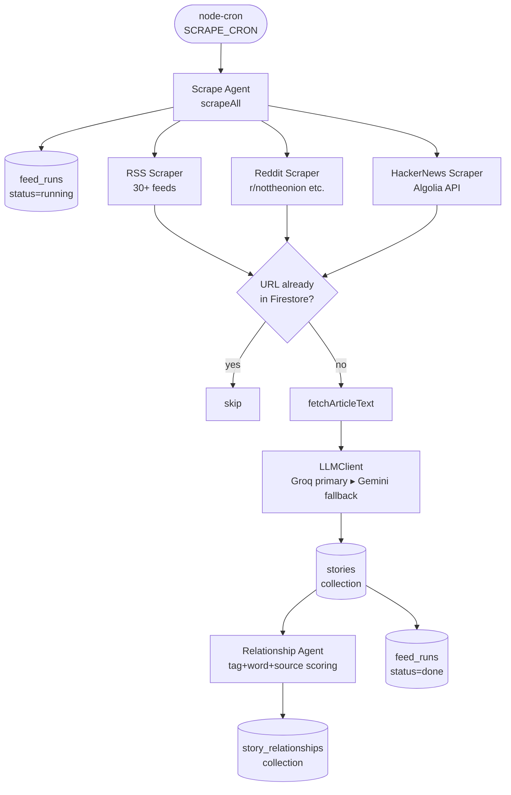
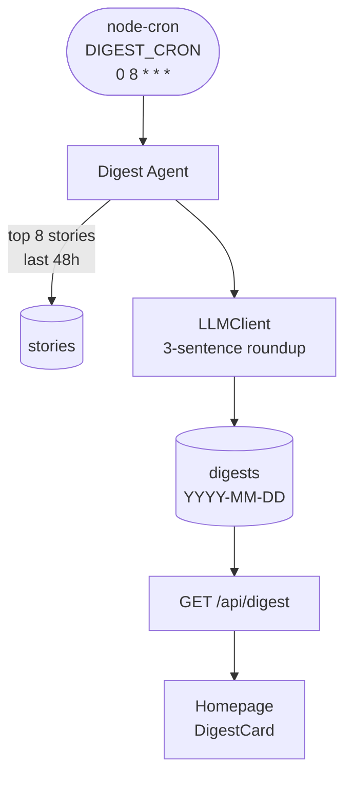
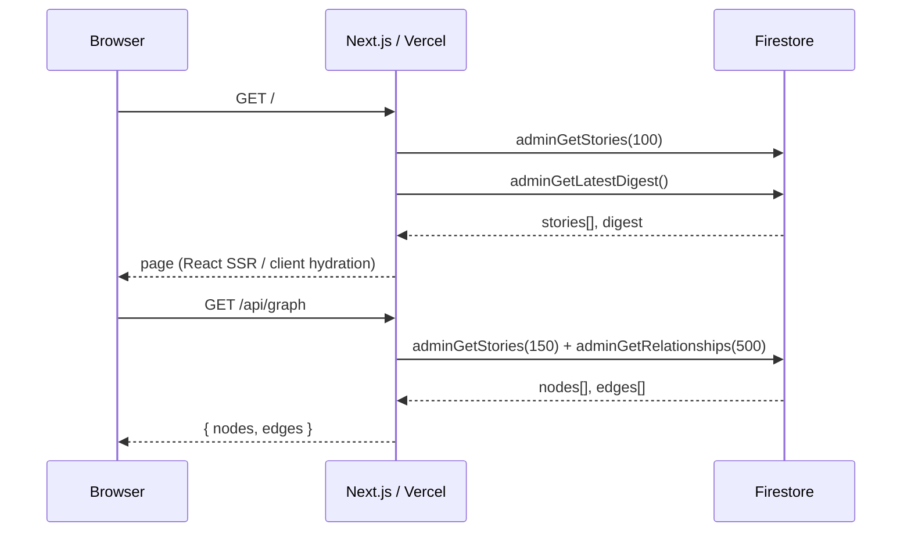

# System Architecture

FunnyNews is a **multi-agent news pipeline** deployed across two runtimes: a Next.js frontend on Vercel and a long-running Express daemon on Railway. Agents run inside the Railway container on cron schedules; the frontend reads their output from Firestore.

---

## High-Level Overview

```
┌─────────────────────────────────────────────────────────────────────┐
│                        Railway Backend (daemon)                      │
│                                                                      │
│  ┌──────────────┐   ┌──────────────────┐   ┌──────────────────────┐ │
│  │ Scrape Agent │──▶│ Relationship Agent│   │   Digest Agent       │ │
│  │ (every 2h)   │   │ (post-scrape)     │   │   (daily @ 8 AM)     │ │
│  └──────┬───────┘   └────────┬─────────┘   └──────────┬───────────┘ │
│         │                   │                          │             │
│         ▼                   ▼                          ▼             │
│  ┌──────────────────────────────────────────────────────────────┐   │
│  │                   LLMClient                                   │   │
│  │         Groq / llama-3.3-70b-versatile (primary)             │   │
│  │         Google Gemini 2.0 Flash          (fallback)          │   │
│  └──────────────────────────────────────────────────────────────┘   │
│                                                                      │
└─────────────────────────┬───────────────────────────────────────────┘
                          │ Firebase Admin SDK
                          ▼
            ┌─────────────────────────┐
            │   Firestore (4 colls)   │
            │  stories                │
            │  story_relationships    │
            │  feed_runs              │
            │  digests                │
            └────────────┬────────────┘
                         │
            ┌────────────▼────────────┐
            │  Next.js on Vercel      │
            │  (app router + API routes)│
            └─────────────────────────┘
                         │
                    User browser
```

---

## Data Flow — Scrape Cycle



---

## Data Flow — Daily Digest



---

## Read Path (Frontend)



---

## Deployment Topology

| Service | Platform | Trigger | Resources |
|---|---|---|---|
| Next.js frontend + API routes | **Vercel** | Push to `main` | Serverless functions |
| Express daemon + agents + crons | **Railway** | Push to `main` | Persistent container (`Railpack` build) |
| Firestore | **Google Cloud** | SDK calls | Spark → Blaze plan |

The backend's [`railway.toml`](../backend/railway.toml) handles build configuration. The `Dockerfile` at `backend/Dockerfile` is used by Railpack.
